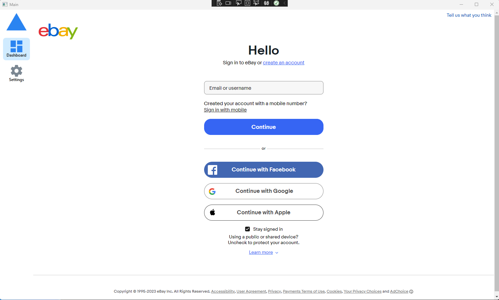
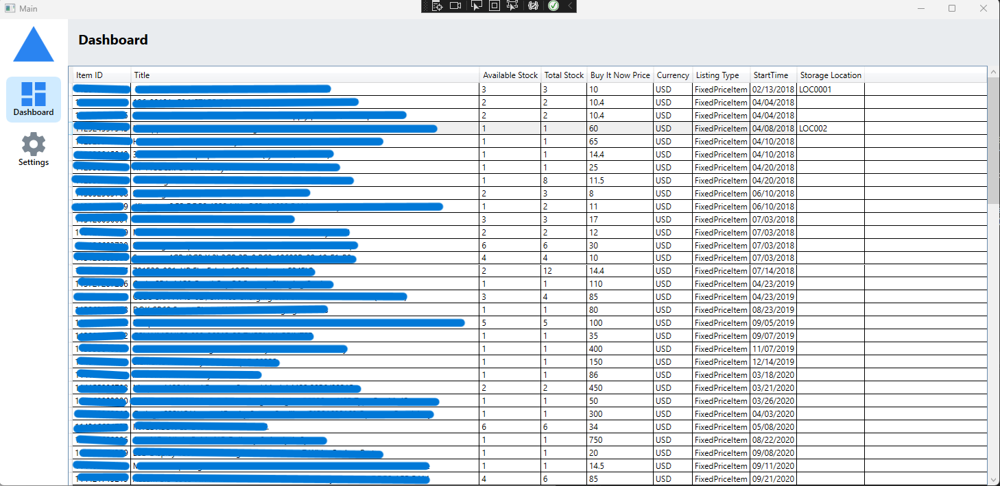
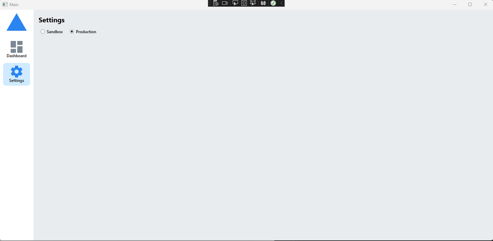

# eBay API Inventory Application

A WPF application that uses the eBay Trading API to retrieve a sellers my selling list. App uses eBay OAUTH 2.0 authorization flow powered by RESTful web service calls. 

[eBay Authorization Guide](https://developer.ebay.com/api-docs/static/authorization_guide_landing.html)

[Trading GetMyeBaySelling Reference](https://developer.ebay.com/Devzone/XML/docs/Reference/eBay/GetMyeBaySelling.html)

The selling list is enhanced by a local SQL lite database. The local database keeps track of a copy of the data that comes back from eBay, entries that exist in the copy are updated every request, and new entries are added with every request. 

Auth Token is also kept track of by the local database, and refreshed based on whether or not enough time has elapsed since it was inserted. The elapsed time calculation is done by saving the token with a timestamp in seconds, and the difference is taken every launch, and if that difference is larger than the shelf life of the access token provided by eBay, a refresh web service is called to update the token. 

## Login Screen

A WebView2, latest chromium based view Microsoft offers to display web content. If user consents, they're taken to dashboard. If they do not consent, the login page is reloaded. 

## Dashboard Screen

A table that displays the data from eBay. Adding a column to allow user to enter a storage location. Storage location is stored in local database. 
Information redacted to protect live data.

## Settings Screen

eBay offers you a Sandbox environment, the app allows user to switch between the two. 

## Posible Future Phases
* Taking advantage of paginated my selling request and making the dashboard table capable of navigating through pages of content.
* Integrating more requests from the API to possibly create, edit, delete inventory directly from app instead of logging into eBay site.
* Customizing UI to make table in dashboard look more modern. 
* Properly use Task, and other async tools to enhance the performance of the large api calls. 